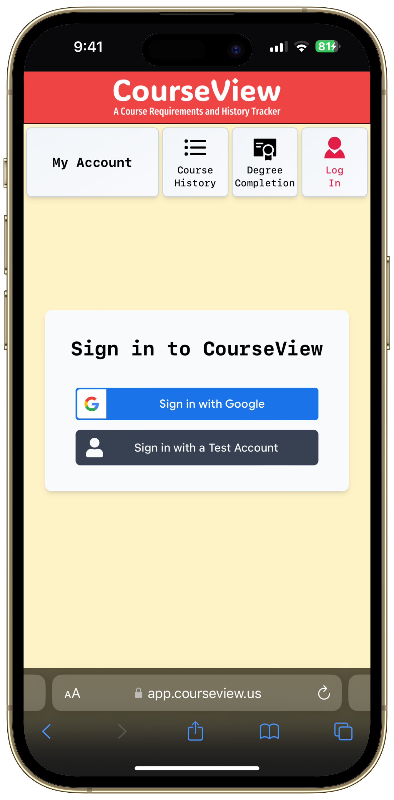
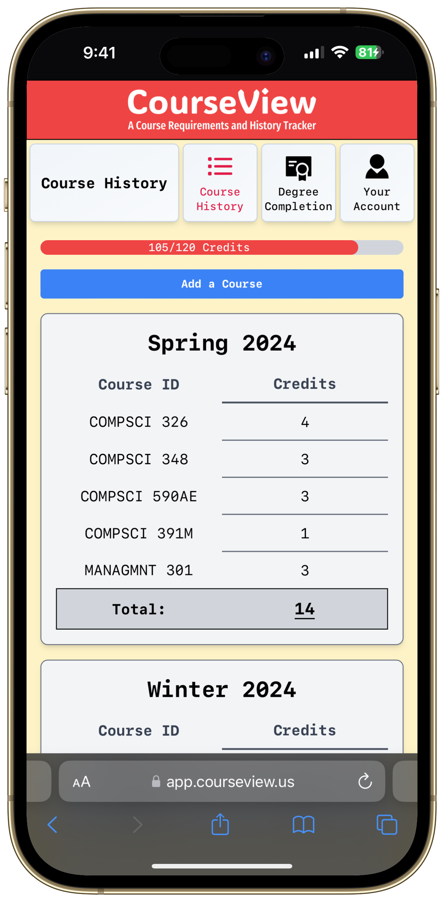
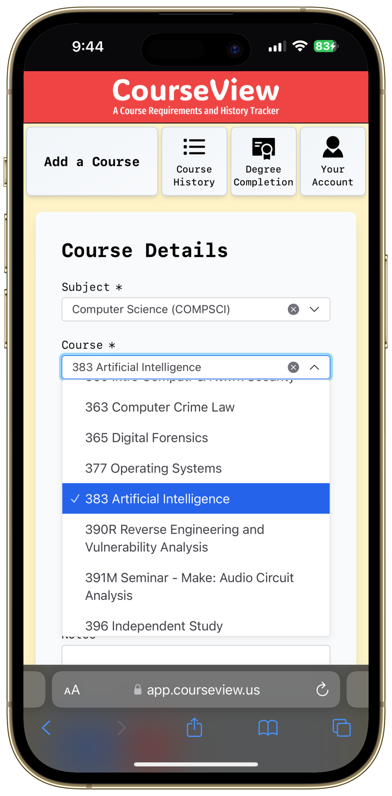
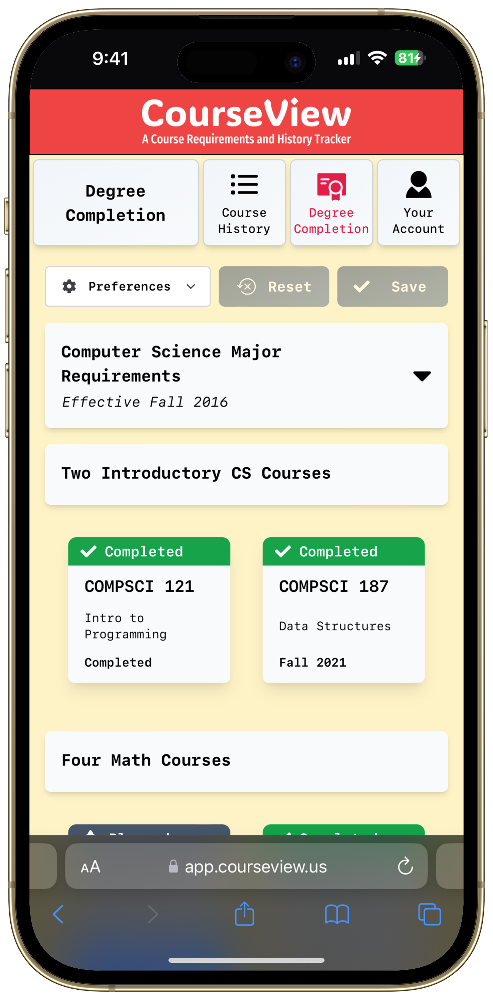

# CourseView

A Course History and Planning Tool for students of UMass Amherst. This project is a part of the CS326 Web Programming course at UMass Amherst.

[Live Preview](https://courseview-umass.vercel.app/)

## App Views

|                  Login                   |                  Course History                   |                 Add a Course                  |                  Degree Completion                   |
| :--------------------------------------: | :-----------------------------------------------: | :-------------------------------------------: | :--------------------------------------------------: |
|  |  |  |  |

# Getting Started

This repository is organized into two main directories.

```
.
├── backend
└── frontend
```

To run the project:

```bash
npm install
npm run start
```

Now, you can visit `http://localhost:3000` to view the app.

# Cloning the Repo

```bash
git clone git@github.com:atharvakale343/326-final-project-spring-24.git
# this uses the rebase strategy when pulling, read more about it here: https://git-scm.com/docs/git-config#Documentation/git-config.txt-pullrebase
git config pull.rebase true
```

# Development

## Frontend

In your terminal, navigate to the `frontend` directory and run the following commands:

```bash
cd frontend
npm install
npm run dev
```

Read more about the frontend in the [frontend README](frontend/README.md).

## Backend

```bash
cd backend
npm install
npm run watch
```

Read more about the backend in the [backend README](backend/README.md).
