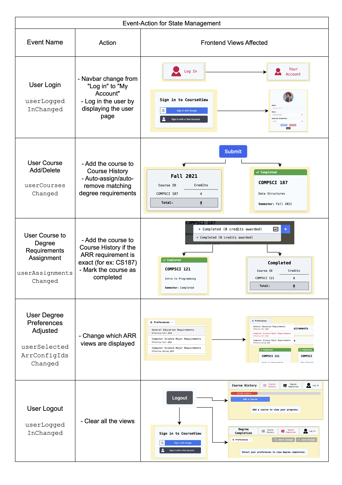

# Getting Started

```bash
npm install
npm run dev
```

# Project Structure

```
.
├── index.html
├── src
│   ├── client
│   │   ├── App.ts
│   │   ├── index.ts
```

The `index.ts` file is the entry point of the application. It is responsible for creating the `App` instance and calling the `render` method.

# Event-Action

This vanilla JS application is built using the Event-Action (Pub-Sub) pattern. Events are managed by the [Events.ts](src/client/Events.ts) class. The `Events` class is a singleton class that manages the events and their listeners.

The following events are used in the application:



# TailwindCSS

Documentation: https://tailwindcss.com/docs/grid-template-columns
Playground: https://play.tailwindcss.com/
Short Tutorial: https://www.youtube.com/playlist?list=PL5f_mz_zU5eXWYDXHUDOLBE0scnuJofO0

# Color Scheme

- Primary: amber-100
- Secondary: red-500

# Icon Libraries

https://fontawesome.com/v4/icon/exclamation-triangle
https://www.svgrepo.com/svg/376180/retry

# Notes

This repository is generated based on a template: [https://github.com/doinel1a/vite-vanilla-ts](https://github.com/doinel1a/vite-vanilla-ts)
